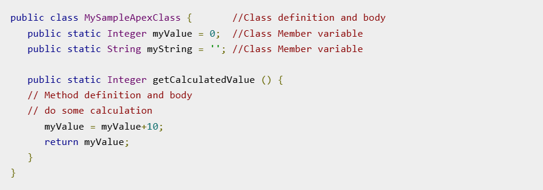

# 📌 TASK-1234 : Contact Object - Email Validation Rule

**🗓️ Tarih:** 11 Mart 2025  
**👤 Geliştiren:** @hibrahimkotan  
**🔄 Task ID:** TASK-1234  
**🎯 Açıklama:** Kullanıcılar Contact kaydı oluştururken veya güncellerken `Email` alanını boş bırakırsa hata mesajı görmelidir.

---

## 🛠️ Teknik Detaylar

- **Validation Rule Adı:** `Email_Mandatory`
- **Uygulanan Nesne:** `Contact`
- **Validation Rule Formula:**
  ```text
  ISBLANK( Email )
  ```
- **Hata Mesajı:** `"Email alanı boş bırakılamaz. Lütfen bir e-posta adresi girin."`
- **Test Edilen Kullanıcı Profilleri:**
  - Standard User ✅
  - System Admin ✅
  - Custom Profile (Sales Rep) ✅

---

## ✅ Test Senaryoları

| Senaryo No | Girdi | Beklenen Sonuç | Sonuç |
|------------|------|---------------|--------|
| 1 | Email boş | Hata mesajı gösterilmeli | ✅ |
| 2 | Email dolu | Kayıt başarılı | ✅ |

---

## 📌 Deployment Adımları

1️⃣ **Validation Rule oluşturuldu:** `Setup → Object Manager → Contact → Validation Rules`  
2️⃣ **Sandbox'ta test edildi.**  
3️⃣ **UAT ortamına aktarıldı.**  
4️⃣ **GitHub PR oluşturuldu ve main branch'e merge edildi.**  

**🔗 PR Link:** [PR-45](https://developer.salesforce.com/docs/atlas.en-us.apexcode.meta/apexcode/apex_classes_defining.htm)  

)

